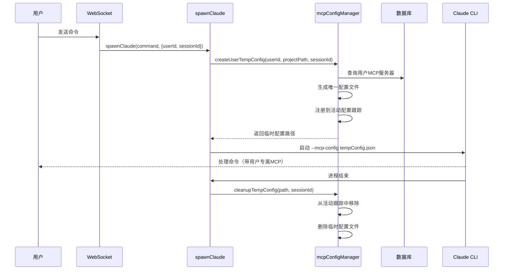

# MCP用户隔离解决方案

## 概述

本方案解决了多用户共享Claude进程时MCP配置相互干扰的问题，确保每个用户只能看到和使用自己的MCP服务器配置。

## 解决的问题

### 原始问题
- 所有用户共享一个Claude CLI进程和配置
- `claude mcp add`添加的服务器对所有用户可见
- 不同用户的MCP配置会互相覆盖
- 用户A可能看到用户B的敏感MCP配置信息

### 新问题（并发安全性）
- 多用户同时创建配置文件可能产生冲突
- 临时配置文件被错误删除
- 配置文件读写竞争条件
- 高并发情况下的文件名冲突

## 解决方案

### 1. 数据库存储 + 临时配置文件

```
用户MCP服务器 (数据库) → 临时配置文件 → Claude CLI --mcp-config
```

### 2. 核心组件

#### **MCP配置管理器** (`mcpConfigManager.js`)
- 🔒 **并发安全**: 文件锁机制防止读写冲突
- 📝 **唯一文件名**: 使用时间戳+随机ID生成唯一文件名
- 🔄 **会话跟踪**: 追踪活动配置文件，防止误删
- 🧹 **智能清理**: 只清理非活动的过期文件
- ✅ **配置验证**: 确保生成的配置格式正确

#### **修改后的spawnClaude函数**
- 🆔 接受`userId`和`sessionId`参数
- 📁 为用户创建会话专属的临时MCP配置
- 🚀 使用`--mcp-config`参数启动Claude CLI
- 🧹 进程结束时基于会话ID清理配置

## 技术特性

### 🔒 **并发安全性**
```javascript
// 文件锁机制
async acquireFileLock(filePath) {
  if (this.configLocks.has(filePath)) {
    await this.configLocks.get(filePath); // 等待现有锁
  }
  // 创建新锁...
}

// 唯一文件名生成
generateUniqueConfigName(userId, sessionId) {
  const timestamp = Date.now();
  const randomId = crypto.randomBytes(8).toString('hex');
  return `claude-config-user-${userId}-session-${sessionId}-${timestamp}-${randomId}.json`;
}
```

### 🔄 **会话跟踪**
```javascript
// 活动配置跟踪
this.activeConfigs = new Map(); // sessionId -> { configPath, userId, createTime }

// 创建配置时注册
if (sessionId) {
  this.activeConfigs.set(sessionId, {
    configPath: tempConfigPath,
    userId: userId,
    createTime: Date.now()
  });
}
```

### 🧹 **智能清理**
```javascript
// 检查配置是否在使用中
isConfigInUse(configPath) {
  for (const [sessionId, configInfo] of this.activeConfigs.entries()) {
    if (configInfo.configPath === configPath) {
      return true; // 保护活动文件
    }
  }
  return false;
}
```

### 🛡️ **用户隔离**
- 每个用户只能访问自己的MCP服务器
- 数据库级别的用户ID隔离
- 配置文件包含用户专属的MCP设置

## 使用流程



## 安全保证

### 1. **用户隔离** ✅
- ✅ 用户只能看到自己的MCP服务器
- ✅ 无法访问其他用户的配置
- ✅ 支持相同名称在不同用户间存在

### 2. **并发安全** ✅
- ✅ 文件锁防止读写冲突
- ✅ 唯一文件名避免冲突
- ✅ 会话跟踪防止误删
- ✅ 活动配置保护

### 3. **资源管理** ✅
- ✅ 自动清理临时文件
- ✅ 定期清理过期配置
- ✅ 异常退出时的孤儿文件处理
- ✅ 内存中的活动配置追踪

## 测试验证

### 基础功能测试
```bash
node test-mcp-isolation.js
```
- ✅ 用户隔离验证
- ✅ 多种传输类型支持
- ✅ 配置生成和验证

### 并发安全性测试
```bash
node test-mcp-concurrency.js
```
- ✅ 并发配置创建
- ✅ 文件锁机制
- ✅ 活动配置追踪
- ✅ 智能清理保护

## 性能特点

### 优点 ✅
- **隔离性强**: 完全的用户级隔离
- **并发安全**: 支持多用户同时使用
- **自动清理**: 无需手动维护临时文件
- **向后兼容**: 不影响现有功能
- **资源高效**: 只在需要时创建配置文件

### 考虑因素
- **临时文件**: 每个会话创建临时配置文件
- **内存开销**: 追踪活动配置信息
- **磁盘IO**: 配置文件的创建和删除

## 扩展性

### 未来优化方向
1. **配置缓存**: 相同用户的配置可以复用
2. **压缩存储**: 对大量MCP配置进行压缩
3. **分布式支持**: 跨节点的配置同步
4. **监控告警**: 配置文件泄露监控

## 故障排除

### 常见问题
1. **临时目录权限**: 确保可写入`/tmp/claude-code-ui-configs/`
2. **磁盘空间**: 监控临时目录大小
3. **孤儿文件**: 定期检查和清理过期文件
4. **并发限制**: 高并发时的性能调优

### 监控指标
- 活动配置文件数量
- 临时目录大小
- 配置文件平均存活时间
- 并发配置创建成功率

## 总结

本解决方案通过**数据库存储 + 临时配置文件 + 会话跟踪**的方式，完美解决了MCP用户隔离和并发安全问题，确保多用户环境下的Claude CLI使用体验既安全又高效。